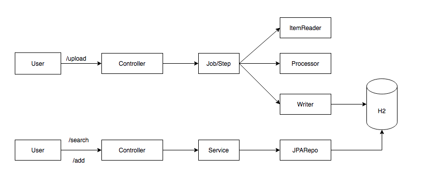
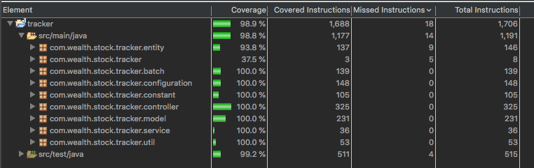
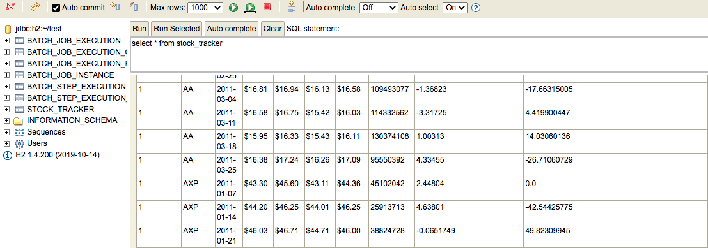
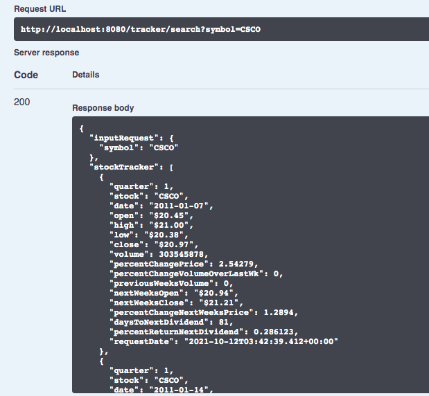
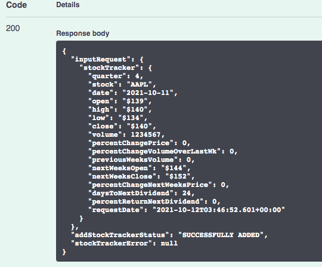

# Tracker
Application to track the stock information every week. 

### High Level Design

### Swagger Endpoint

http://localhost:8080/swagger-ui/  

if swagger endpoint not working, do "mvn clean install"

### H2 In-Memory Endpoint

http://localhost:8080/h2-console

### API Details

| Operation 	    | Action 	| API 	                    | Sample Data 	                                            |
| ---     	    |---     	|---	                        |---                                                      	|
| File Upload 	| Post 	    | /tracker/upload 	        | use the file under src/main/resources/dow_jones_index.csv 	|
| Search Stock 	| Get 	    | /tracker/search?symbol= 	| use the ticker symbol from uploaded file 	                |
| add Stock 	    | Post   	| /tracker/add 	            | use the stockTracker object 	                            |

### Junit Coverage

### Instructions to execute
1. Checkout the code from main branch
2. Import as maven project if using the IDE & run as spring boot project
3. If IDE is not used, do mvn clean install for generating the jar. Execute the jar

### Result

#####File Upload

#####Search Stock

#####Add Stock

